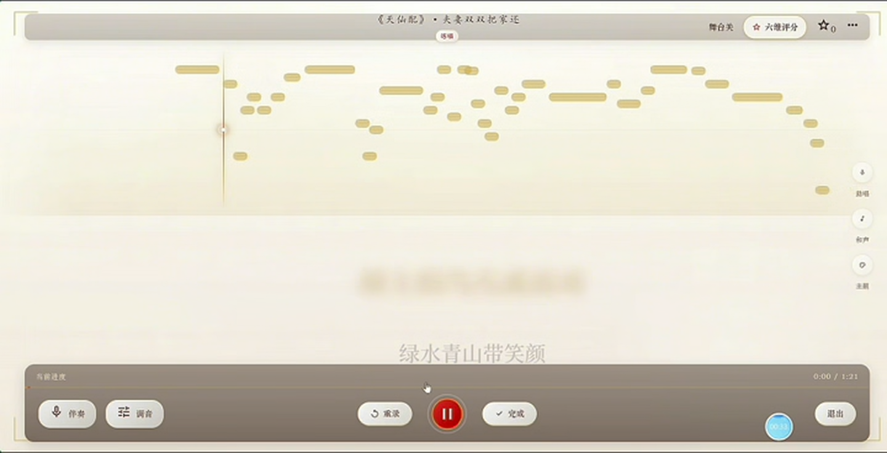
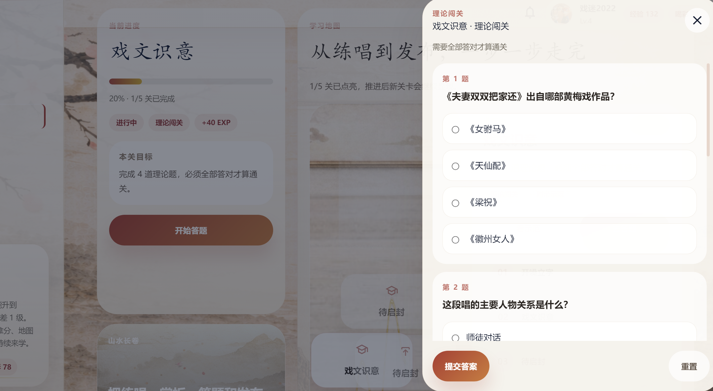
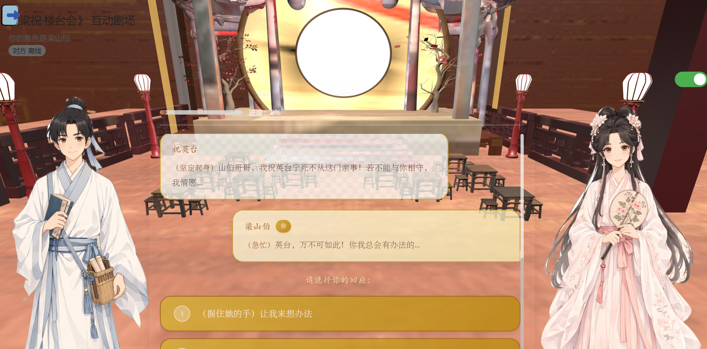

<div align="center">

# Meiyun Xinsheng

**An interactive Huangmei opera learning platform for guided singing, practice analysis and reference-performance comparison.**

`React` · `TypeScript` · `Web Audio API` · `YIN pitch tracking` · `IndexedDB`

</div>

<table>
<tr>
<td colspan="2"></td>
</tr>
<tr>
<td width="50%"></td>
<td width="50%"></td>
</tr>
</table>

The learning module lets a student rehearse a passage line by line, record or upload an attempt, compare it with a reference performance and review six-dimensional feedback at both session and lyric-line level.

## Highlights

- **Guided singing** with synchronised lyrics, reference playback and live pitch-contour visualisation.
- **Browser-side audio analysis** using YIN-style pitch tracking, cents deviation and timing-offset search.
- **Six-dimensional review** across pitch, rhythm, articulation, style, breath and emotion.
- **Practice history** stored per user, with comparison across attempts and publishable performance summaries.

## Learning experience

| Stage | What the learner sees | Core implementation |
| --- | --- | --- |
| Rehearse | Line-by-line karaoke guidance | `KaraokePlayer`, `LyricsDisplay` |
| Perform | Recording or uploaded audio | `AudioAnalyzer`, browser audio APIs |
| Compare | Singer contour against the target | `usePitchDetection`, `pitchMath` |
| Diagnose | Per-line timing and pitch feedback | `estimateOffsetMs`, alignment logic |
| Review | Radar chart and improvement advice | Six-dimension scoring and session history |

Pitch and rhythm are derived from the analysed signal. The remaining dimensions use the comparison result and calibrated proxy features to produce a consistent coaching view.

## Architecture

The client owns the interactive learning flow, playback, pitch extraction, timing comparison and local persistence. Optional services under `server/learn-ai/` add generated advice and audio-analysis integrations through GLM and Qwen providers.

```text
reference performance + lyrics
              │
              ▼
guided playback ──► learner recording/upload
                            │
                            ▼
                pitch and timing analysis
                            │
                            ▼
             six-dimension review + history
```

## Quick start

Requires Node.js 20+.

```bash
cd client
npm install
npm run dev
```

Open `http://127.0.0.1:5173`. The client includes an IndexedDB implementation behind the same storage contracts, so the main learning flow does not require an account or hosted database.

```bash
npm run test          # run the Vitest suite from client/
node server/server.js # optional AI-advice and analysis services
```

<details>
<summary>Optional services and media</summary>

Hosted services are configured with `VITE_FIREBASE_*`, `VITE_SUPABASE_URL`, `VITE_SUPABASE_ANON_KEY`, `GLM_API_KEY` and `DASHSCOPE_API_KEY`. No credentials are committed.

Reference recordings, accompaniment stems and large demonstration videos are distributed separately; without them, the interface falls back to lyric-led guidance. Asset provenance is documented in `client/src/learn/assets/SOURCES.md`.

</details>

## Project context

**Role:** Learning Module Developer in a three-person team. Responsible for guided singing, uploaded-audio practice, browser-side analysis, six-dimensional feedback and the corresponding report section.

The project received a **Northwest regional first prize** in the Chinese Collegiate Computing Competition.

## License

See [LICENSE](LICENSE) for portfolio and evaluation terms.
